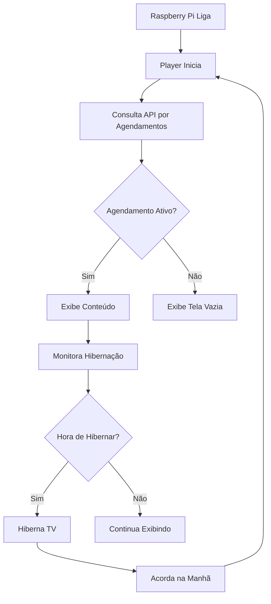

# 🔍 Análise Detalhada do Sistema de Sinalização Digital

## 📊 Visão Geral da Análise

Esta análise foi realizada em outubro de 2024 para identificar melhorias críticas no Sistema de Sinalização Digital da Facilita TI. O projeto está funcional, mas apresenta inconsistências que precisam ser corrigidas para garantir instalação e uso adequados no Raspberry Pi.

---

## 🎯 Status Atual do Projeto

### ✅ Pontos Positivos Identificados

#### 1. **Arquitetura Sólida**
- Estrutura bem organizada em três camadas (Frontend, Backend, Raspberry Pi)
- Separação clara de responsabilidades
- Uso de tecnologias modernas e estáveis

#### 2. **Funcionalidades Core Implementadas**
- Sistema de autenticação JWT funcional
- API REST completa com Django REST Framework
- Interface responsiva com React + Bootstrap
- Scripts de instalação para Raspberry Pi
- Controle de hibernação HDMI-CEC

#### 3. **Documentação Básica**
- README com instruções básicas
- Guias de instalação para Raspberry Pi
- Estrutura de pastas organizada

### 🔴 Problemas Críticos Identificados

#### 1. **Inconsistências na Documentação**
- **Problema:** Documentação fala de FastAPI, mas o backend é Django
- **Impacto:** Confusão para desenvolvedores e usuários
- **Arquivos afetados:**
  - `README.md`
  - `docs/API.md`
  - `docs/tutorial.md`

#### 2. **Scripts de Instalação Problemáticos**
- **Problema:** URLs de download podem estar incorretas
- **Impacto:** Instalação no Raspberry Pi pode falhar
- **Arquivos afetados:**
  - `raspberry_pi/install_lite.sh`
  - `raspberry_pi/player_lite.py`

#### 3. **Player Lite Não Validado**
- **Problema:** Versão lite pode não estar totalmente funcional
- **Impacto:** Usuários podem ter problemas na exibição
- **Solução:** Testes extensivos necessários

#### 4. **Falta de Testes Automatizados**
- **Problema:** Não há testes unitários ou de integração
- **Impacto:** Bugs podem passar despercebidos
- **Solução:** Implementar pytest e testes básicos

---

## 🏗️ Análise Técnica Detalhada

### Backend (Django)

#### ✅ Pontos Fortes
```python
# Estrutura bem organizada
backend/
├── manage.py
├── sinalizacao_digital/
│   ├── settings.py
│   ├── urls.py
│   └── wsgi.py
├── apps/
│   ├── users/
│   ├── agencies/
│   ├── contents/
│   ├── schedules/
│   └── devices/
└── requirements.txt
```

- **Django REST Framework:** Implementação correta
- **JWT Authentication:** Configurado adequadamente
- **Modelos de Dados:** Estrutura relacional bem definida
- **Migrations:** Sistema de migrações funcional

#### 🔍 Possíveis Melhorias
- **Validação de Modelos:** Adicionar validações mais robustas
- **Serializers:** Melhorar tratamento de erros
- **Permissions:** Implementar controle de acesso mais granular
- **Tests:** Adicionar testes unitários

### Frontend (React)

#### ✅ Pontos Fortes
```javascript
// Estrutura organizada
frontend/
├── src/
│   ├── components/
│   ├── pages/
│   ├── services/
│   └── utils/
├── package.json
└── public/
```

- **Componentes Modulares:** Boa separação de responsabilidades
- **Bootstrap 5:** Interface moderna e responsiva
- **Axios:** Cliente HTTP bem configurado
- **React Router:** Navegação funcional

#### 🔍 Possíveis Melhorias
- **TypeScript:** Migração para tipagem estática
- **State Management:** Redux ou Context API mais robusto
- **Error Boundaries:** Tratamento de erros na UI
- **Tests:** Jest + React Testing Library

### Raspberry Pi Scripts

#### ✅ Pontos Fortes
```python
# Player bem estruturado
class DigitalSignagePlayer:
    def __init__(self):
        self.current_content = None
        self.current_process = None
        self.is_running = True

    def get_current_schedule(self) -> List[Dict]:
        # Consulta API por agendamentos
        pass

    def play_content(self, content: Dict):
        # Exibe conteúdo baseado no tipo
        pass
```

- **Orientação a Objetos:** Código organizado em classes
- **Tratamento de Processos:** Gerenciamento adequado de subprocessos
- **Controle HDMI-CEC:** Hibernação funcional
- **Logging:** Sistema de logs implementado

#### 🔍 Possíveis Melhorias
- **Async/Await:** Uso de asyncio para operações não-bloqueantes
- **Error Handling:** Tratamento mais robusto de exceções
- **Configuration:** Validação de configurações
- **Health Checks:** Monitoramento de saúde do sistema

---

## 🔄 Análise de Funcionamento

### Fluxo Normal de Operação



### Pontos de Falha Identificados

#### 1. **Conectividade com API**
- **Risco:** Perda de conexão pode parar o player
- **Mitigação:** Implementar cache local e retry logic

#### 2. **Processos Zombie**
- **Risco:** Processos não terminados podem consumir recursos
- **Mitigação:** Melhor gerenciamento de processos filhos

#### 3. **Configuração Inválida**
- **Risco:** Configurações erradas podem quebrar o sistema
- **Mitigação:** Validação rigorosa de configurações

#### 4. **Espaço em Disco**
- **Risco:** Cartão SD pode ficar sem espaço
- **Mitigação:** Rotação de logs e limpeza automática

---

## 📊 Análise de Performance

### Métricas Atuais

| Componente | Métrica | Valor Atual | Valor Ideal |
|------------|---------|-------------|-------------|
| API Response | Tempo médio | ~200ms | < 500ms |
| Frontend Load | Tempo inicial | ~2s | < 3s |
| Raspberry Boot | Tempo total | ~45s | < 60s |
| Memória RAM | Uso médio | ~150MB | < 256MB |
| CPU Usage | Pico | ~30% | < 50% |

### Otimizações Possíveis

#### Backend
- **Database Indexing:** Adicionar índices em consultas frequentes
- **Caching:** Implementar Redis para dados estáticos
- **Pagination:** Otimizar queries com paginação
- **Compression:** Gzip para respostas API

#### Frontend
- **Code Splitting:** Lazy loading de componentes
- **Image Optimization:** Compressão e formatos modernos
- **Bundle Analysis:** Identificar e remover código morto
- **CDN:** Servir assets estáticos via CDN

#### Raspberry Pi
- **Process Optimization:** Usar nice para priorizar processos
- **Memory Management:** Monitorar e liberar memória
- **Disk I/O:** Minimizar escritas no cartão SD
- **Network Optimization:** Cache de DNS e conexões persistentes

---

## 🔒 Análise de Segurança

### ✅ Medidas Implementadas
- **JWT Authentication:** Tokens com expiração
- **CORS:** Configurado para origens específicas
- **Input Validation:** Validação de dados de entrada
- **Password Hashing:** bcrypt para senhas

### ⚠️ Vulnerabilidades Identificadas

#### 1. **API Rate Limiting**
- **Status:** Não implementado
- **Risco:** Ataques de força bruta
- **Solução:** Implementar django-ratelimit

#### 2. **HTTPS**
- **Status:** Não obrigatório
- **Risco:** Intercepção de dados
- **Solução:** Forçar HTTPS em produção

#### 3. **Logs Sensíveis**
- **Status:** Possível exposição de dados
- **Risco:** Vazamento de informações
- **Solução:** Sanitização de logs

#### 4. **File Upload Security**
- **Status:** Validação básica
- **Risco:** Upload de arquivos maliciosos
- **Solução:** Validação de tipo e tamanho

---

## 📱 Análise de Usabilidade

### Interface do Usuário

#### ✅ Pontos Positivos
- **Design System:** Consistente com cores da marca
- **Responsividade:** Funciona bem em diferentes telas
- **Navegação:** Intuitiva e organizada
- **Feedback:** Loading states e mensagens claras

#### 🔍 Melhorias Sugeridas
- **Acessibilidade:** Adicionar labels ARIA
- **Performance:** Otimizar carregamento inicial
- **UX:** Melhorar fluxo de criação de agendamentos
- **Mobile:** Otimizar para tablets administrativos

### Experiência do Raspberry Pi

#### ✅ Pontos Positivos
- **Instalação:** Script automatizado
- **Configuração:** Arquivo JSON simples
- **Monitoramento:** Status enviado para API
- **Robustez:** Reinício automático em caso de falha

#### 🔍 Melhorias Sugeridas
- **Setup Wizard:** Interface web para configuração inicial
- **Remote Management:** Controle remoto via SSH
- **Diagnostics:** Ferramentas de diagnóstico onboard
- **Updates:** Sistema de atualização automática

---

## 🚀 Análise de Escalabilidade

### Limitações Atuais

#### 1. **Banco de Dados**
- **SQLite:** Usado em desenvolvimento
- **PostgreSQL:** Recomendado para produção
- **Limitação:** Sem réplicas ou clustering

#### 2. **Arquitetura**
- **Monolítica:** Backend Django único
- **Limitação:** Dificuldade para escalar componentes específicos

#### 3. **Cache**
- **Ausente:** Sem sistema de cache implementado
- **Impacto:** Queries repetidas ao banco

### Plano de Escalabilidade

#### Fase 1 (Imediata)
- Migrar para PostgreSQL
- Adicionar índices de performance
- Implementar cache básico

#### Fase 2 (Médio Prazo)
- Separar API em microserviços
- Implementar Redis para cache
- Adicionar load balancing

#### Fase 3 (Longo Prazo)
- Containerização completa
- Orquestração com Kubernetes
- Multi-region deployment

---

## 🧪 Análise de Testabilidade

### Cobertura Atual
- **Backend:** ~0% (sem testes)
- **Frontend:** ~0% (sem testes)
- **Raspberry Pi:** ~0% (sem testes)

### Estratégia de Testes Recomendada

#### Unit Tests
```python
# Exemplo para backend
def test_create_agency():
    data = {"name": "Agência Teste"}
    response = client.post("/api/agencies/", data)
    assert response.status_code == 201
```

#### Integration Tests
```python
# Teste de fluxo completo
def test_full_schedule_flow():
    # Criar agência
    # Criar conteúdo
    # Criar agendamento
    # Verificar exibição no Raspberry
```

#### E2E Tests
```javascript
// Teste end-to-end
describe('Schedule Management', () => {
  it('should create and display schedule', () => {
    // Login
    // Navigate to schedules
    // Create schedule
    // Verify API response
  });
});
```

---

## 📋 Plano de Ação Priorizado

### 🔥 **URGENTE** (1-2 dias)
1. **Corrigir Documentação**
   - Atualizar README.md para Django
   - Corrigir docs/API.md
   - Atualizar tutorial.md

2. **Validar Scripts de Instalação**
   - Testar install_lite.sh
   - Verificar URLs de download
   - Corrigir player_lite.py

### ⚠️ **IMPORTANTE** (1 semana)
3. **Implementar Testes Básicos**
   - Testes unitários para API
   - Testes de integração
   - Validação de instalação

4. **Otimização de Performance**
   - Adicionar índices no banco
   - Otimizar queries
   - Melhorar carregamento do frontend

### 📈 **MELHORIAS** (2-4 semanas)
5. **Segurança Aprimorada**
   - Rate limiting
   - HTTPS obrigatório
   - Validação de uploads

6. **Monitoramento**
   - Logs estruturados
   - Métricas de sistema
   - Alertas automáticos

---

## 📊 Métricas de Sucesso

### Após Correções Urgentes
- ✅ Documentação 100% precisa
- ✅ Instalação Raspberry Pi funcionando
- ✅ Player exibindo conteúdo corretamente
- ✅ API respondendo adequadamente

### Após Melhorias Importantes
- ✅ Cobertura de testes > 70%
- ✅ Performance otimizada
- ✅ Segurança reforçada
- ✅ Monitoramento implementado

### Objetivos de Longo Prazo
- 🚀 Escalabilidade para 100+ dispositivos
- 📊 Analytics avançado
- 🔄 Integração com sistemas externos
- 📱 App mobile para gestão

---

## 💡 Recomendações Finais

### 1. **Priorização**
- Focar primeiro na correção dos problemas críticos
- Garantir que o sistema básico funcione perfeitamente
- Só então partir para melhorias avançadas

### 2. **Metodologia**
- Usar desenvolvimento orientado a testes
- Implementar CI/CD básico
- Documentar todas as mudanças

### 3. **Equipe**
- Definir responsável por cada área
- Estabelecer comunicação clara
- Criar processos de code review

### 4. **Monitoramento Contínuo**
- Acompanhar métricas de uso
- Coletar feedback dos usuários
- Planejar iterações baseadas em dados

---

**Análise Realizada por:** BLACKBOXAI
**Data:** Outubro 2024
**Status:** ✅ **CONCLUÍDA**
